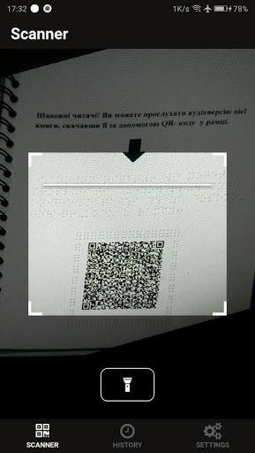
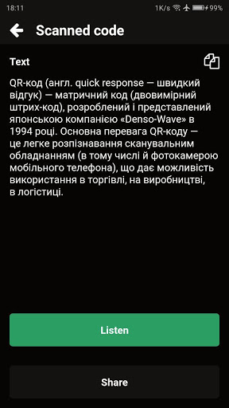
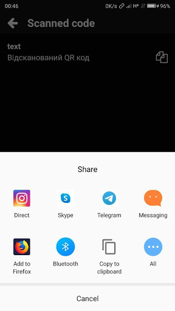

# QReader
React native application for reading QR-code and reproduces the message with a synthesized voice.

### Functionality 
 * text to speech
 * use flashlight 
 * copy to clipboard/share qr code value
 * see/remove own history of scanned qr codes
 * change language
 * adjust speaking rate
 
### [Get it on Google Play](https://play.google.com/store/apps/details?id=com.qr_speaker&hl=en)
